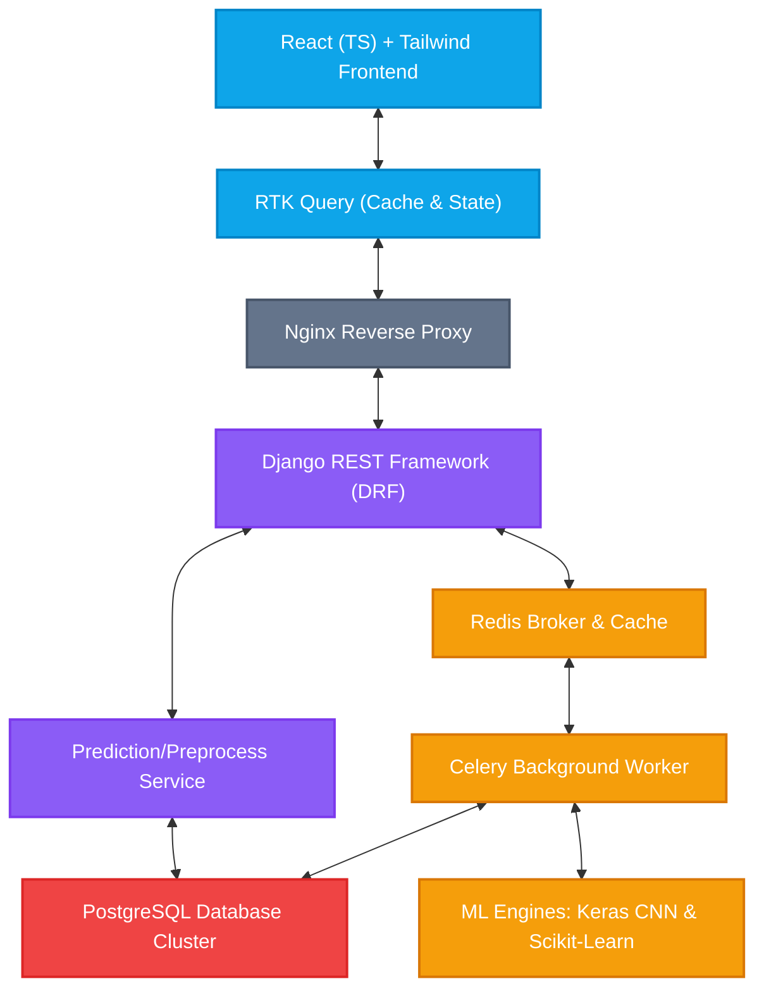

# 🧠 Multimodal Emotion Recognition AI Platform (`emotion`)
> **Production-Grade System Architecture**: Django REST Framework + React 18 + Redux Toolkit + TypeScript + Multimodal ML Inference Engine (Face, Text, Speech)

---

## 📌 Project Vision & Core Philosophy
The `emotion` platform is an enterprise-grade web application engineered to ingest, process, and analyze emotional expressions across multiple modalities: **Facial Expressions (Vision)**, **Textual Sentiments (NLP)**, and **Speech Tonality (Audio)**. 

Designed under **Strict Separation of Concerns (SoC)**, robust type safety, domain-driven feature isolation, and scalable asynchronous processing, the system is split into two primary components:
*   **Backend (Django REST Framework)**: Coordinates secure JWT authentication, relational schemas, a thread-safe singleton Machine Learning loader, and prediction logging.
*   **Frontend (React + Vite + TypeScript)**: Delivers a responsive, state-of-the-art UI/UX, handles global state via Redux Toolkit, coordinates network cache with RTK Query, and isolates specialized prediction widgets.

---

## ⚙️ High-Level System Architecture
The following multi-tier system topology visualizes the routing flow from client state actions down to the asynchronous worker queues and ML inference runners.



---

## 🧠 Multimodal ML Engines & Processing Pipelines
To prevent CPU/GPU heavy prediction bottlenecks in HTTP view requests, this architecture isolates all inference execution in a structured **Service and Task Layer**:

### 1. 👁️ Face Emotion Engine
*   **Model Architecture**: Keras Convolutional Neural Network (CNN) (`face_model.h5`) combined with a Label Encoder pickle file (`face_encoder.pkl`).
*   **Processing**: Ingests image dimensions or video streams, extracts region-of-interest facial landmarks, standardizes pixel resolutions, and classifies emotion categories.

### 2. 📝 NLP Text Classifier
*   **Model Architecture**: Scikit-Learn Logistic Regression model (`nlp_model.pkl`) coupled with a text vectorizer (`vectorizer.pkl`).
*   **Processing**: Processes raw textual strings, applies tokenization, computes TF-IDF embeddings, and maps input variables to target sentiment scores.

### 3. 🎙️ Speech Vocal Classifier
*   **Model Architecture**: Keras Deep Neural Network (`speech_model.h5`) combined with a label encoder (`speech_encoder.pkl`).
*   **Processing**: Ingests raw audio files, extracts acoustic features (such as MFCCs, chroma, and mel spectrograms), and predicts vocal emotional profiles.

---

## 🛠️ Scalable Technology Stack

| Architecture Layer | Technology Stack | Features & Architectural Value |
| :--- | :--- | :--- |
| **Frontend Core** | React 18, TypeScript, Vite | Ultra-fast build times, compilation safety, declarative UI rendering. |
| **State Management** | Redux Toolkit (RTK) | Centralized global store, clean slices, feature-based reducer architecture. |
| **API Client & Caching** | RTK Query | Auto-caching, optimistic updates, loading states, and zero-boilerplate polling. |
| **Styling & UI** | Tailwind CSS + shadcn/ui | Atomic design tokens, fluid layouts, custom themes, and glassmorphic designs. |
| **Backend Framework** | Django + Django REST Framework | Mature ORM, highly secure middleware, scalable authentication, and automatic serializers. |
| **Database** | PostgreSQL | Transactional integrity, relational schemas, high-efficiency indexing. |
| **Broker & Cache** | Redis | High-speed key-value cache, memory storage, and message broker for Celery queues. |
| **Task Queueing** | Celery | Handles heavy, long-running processes asynchronously (e.g., model retraining). |
| **ML Engine Runtime** | TensorFlow / Keras, Scikit-Learn, joblib | Multi-format model compatibility, preprocessors, and low-latency loaded pipelines. |
| **Infrastructure** | Docker, Nginx, Gunicorn | Containerization, load balancing, SSL termination, and concurrency management. |

---

## 📁 Repository Directory Structures

This repository follows a strict **decoupled enterprise folder splitting** architecture pattern.

### 🐍 Backend Directory Layout (`/backend`)
```
backend/
├── manage.py                   # Django administration entrypoint
├── .env.example                # Configuration parameters template
├── config/                     # Core project configuration
│   ├── __init__.py
│   ├── urls.py                 # Core routing system
│   ├── wsgi.py                 # Web Server Gateway Interface for production
│   ├── asgi.py                 # Asynchronous ASGI config
│   ├── celery.py               # Celery application initialization
│   └── settings/               # Environment-split settings system
│       ├── __init__.py
│       ├── base.py             # Shared global configuration
│       ├── development.py      # Local developer overrides and debug flags
│       ├── production.py       # Hardened server-side configurations
│       └── testing.py          # Isolated test database and suite configurations
├── requirements/               # Segmented dependency matrices
│   ├── base.txt                # Essential system runtimes
│   ├── development.txt         # Formatting, styling, and debugging tools
│   ├── production.txt          # Gunicorn and high-performance server bindings
│   └── testing.txt             # Pytest and coverage tools
├── docker/                     # Container execution manifests
│   ├── backend/                # Backend Dockerfiles
│   └── nginx/                  # Custom Nginx reverse-proxy setup
├── scripts/                    # Automation scripts (start, seed, migrate)
└── apps/                       # Feature-isolated Django applications
    ├── core/                   # Shared global backend architecture
    │   ├── models/             # Custom abstract base classes
    │   ├── permissions/        # Unified API endpoint authorization rules
    │   ├── middleware/         # Custom interceptors (security headers, telemetry)
    │   ├── exceptions/         # Global API error boundary responders
    │   └── utils/              # Reusable helper modules (pagination, decorators)
    ├── users/                  # Account management, profile processing, and schemas
    ├── authentication/         # JWT token management, refresh loops, and OAuth layers
    ├── dashboard/              # Telemetry widgets and KPI computation endpoints
    ├── notifications/          # Real-time message dispatching
    ├── analytics/              # Event trackers and user activity telemetry
    └── ml_models/              # High-Performance ML Inference Layer
        ├── models.py           # PredictionLog model tracking inputs, latency, and scores
        ├── serializers.py      # Request/response data serialization pipelines
        ├── urls.py             # Prediction endpoint routes
        ├── views.py            # API request handlers triggering prediction services
        ├── services/           # Decoupled business logic (loaders, preprocessors)
        │   ├── prediction_service.py     # Controls real-time inference execution
        │   ├── preprocessing_service.py  # Cleans and standardizes raw payloads
        │   └── model_loader.py           # Thread-Safe Singleton loading Keras & Pickle checkpoints
        └── ml/                 # Binary checkpoints and experiments
            ├── trained_models/ # Serialized weights (tracked outside Git / LFS)
            ├── datasets/       # Local validation files
            └── notebooks/      # Data science exploratory scripts
```

### ⚛️ Frontend Directory Layout (`/frontend`)
```
frontend/
├── package.json                # Project script mappings and dependency locks
├── tsconfig.json               # TypeScript compiler config
├── vite.config.ts              # Vite asset builder configurations and paths
├── src/
│   ├── main.tsx                # Client application mounting node
│   ├── index.css               # Global CSS variables and utility classes
│   ├── app/                    # Global state configuration
│   │   ├── store.ts            # Configured Redux Toolkit instance
│   │   ├── hooks.ts            # Typed hooks: useAppDispatch & useAppSelector
│   │   └── rootReducer.ts      # Consolidated reducer tree
│   ├── services/               # Centralized network layers
│   │   └── api/
│   │       ├── baseApi.ts      # Standard RTK Query base client (interceptors)
│   │       ├── axios.ts        # Modular REST fallback client
│   │       └── endpoints.ts    # Centralized endpoint manifest
│   ├── components/             # Reusable UI & Layout Components (Design System)
│   │   ├── ui/                 # Atomic visual components (buttons, tables, modals)
│   │   ├── layout/             # structural blocks (navbars, sidebars, dashboard grids)
│   │   └── common/             # Global handlers (loaders, protected routes, error walls)
│   ├── hooks/                  # Global helper hooks (useTheme, useWindowSize)
│   ├── utils/                  # Formatting, math, and data structure helper scripts
│   ├── types/                  # Global shared TypeScript interface files
│   └── features/               # Feature-by-Concern Architecture (Domain-driven)
│       ├── auth/               # User session domain
│       │   ├── authSlice.ts    # JWT/session token status trackers
│       │   ├── authApi.ts      # Authentication endpoints (login, logout, refresh)
│       │   ├── authTypes.ts    # Strict interface boundaries for authentication payloads
│       │   └── components/     # Specialized credential login layouts
│       ├── ml/                 # Machine Learning management domain
│       │   ├── mlSlice.ts      # Cache active predictions, track loading models
│       │   ├── mlApi.ts        # Trigger inferences and poll jobs
│       │   ├── mlTypes.ts      # TS Interfaces matching backend serializers
│       │   └── components/     # Interactive inference visualizers & dashboards
│       └── dashboard/          # Analytics and metric charting interface features
```

---

## 🚀 Step-by-Step Local Setup & Run Checklist

### 🔹 Part 1: Backend Deployment
1.  **Configure Environment**:
    ```bash
    cd backend
    python -m venv venv
    # Linux/macOS:
    source venv/bin/activate
    # Windows:
    .\venv\Scripts\activate
    ```
2.  **Install Dependencies**:
    ```bash
    pip install -r requirements/development.txt
    ```
3.  **Local Secrets**:
    Copy `.env.example` to `.env` and fill out database, caching, and secret configurations.
4.  **Database Migration & Seeding**:
    ```bash
    python manage.py migrate
    python manage.py loaddata apps/core/fixtures/seed_data.json
    ```
5.  **Run Development Server**:
    ```bash
    python manage.py runserver
    ```
6.  **Run Asynchronous Celery Workers**:
    Make sure Redis is active locally before running:
    ```bash
    celery -A config worker --loglevel=info
    ```

### 🔹 Part 2: Frontend Deployment
1.  **Install Dependencies**:
    ```bash
    cd frontend
    npm install
    ```
2.  **Run Development Server**:
    ```bash
    npm run dev
    ```
3.  **Production Compilation**:
    ```bash
    npm run build
    ```

---

## 🧠 Thread-Safe Singleton Model Loading Pattern
To prevent multi-second loading latency during inference API calls, this platform leverages a **Thread-Safe Singleton Model Loader** (`model_loader.py`):
*   **Lazy Loading**: TensorFlow/Keras and Scikit-Learn libraries and heavy weights are only loaded on the first API request or during initial warm-up, reducing memory footprints at startup.
*   **Double-Checked Locking**: Thread-safe locks (`threading.Lock()`) prevent race conditions if multiple async requests hit empty model memory segments concurrently.
*   **Model Weights Security**: Large model checkpoint binaries (`face_model.h5`, `nlp_model.pkl`, etc.) are actively ignored by the repository's `.gitignore` and kept secure on external object storages (e.g. S3, GCS) or pulled using Git LFS.

---

## 🧹 Quality Control & Formatting
To ensure team compliance and staff-engineer level quality, the codebase enforces the following tools:

| Domain | Automation Tool | Execution command |
| :--- | :--- | :--- |
| **Backend Formatting** | `Black` | `black .` |
| **Backend Linting** | `Ruff` | `ruff check .` |
| **Frontend Formatting** | `Prettier` | `npm run format` |
| **Frontend Linting** | `ESLint` | `npm run lint` |
| **Commit Security** | `Husky` (Pre-commit hooks) | Automatized on `git commit` |

---

## 📝 Senior Design Principles (ALWAYS & NEVER)

### ❌ NEVER:
*   Write inline styles or hardcode pixel spacing.
*   Place direct API triggers inside presentational UI layouts.
*   Store secrets, environment endpoints, or passwords in plain code.
*   Commit large dataset files or machine learning weights directly to standard git trees.
*   Allow duplicate TypeScript definitions or interfaces across separate domain modules.

### ✅ ALWAYS:
*   Split application views using feature-boundaries.
*   Keep serializers thin and offload heavy procedures to domain services.
*   Optimize database lookups with `select_related` and `prefetch_related`.
*   Handle network states cleanly (Loading, Error, Empty, Success states).
*   Document business flows using comprehensive docstrings and typed interfaces.
